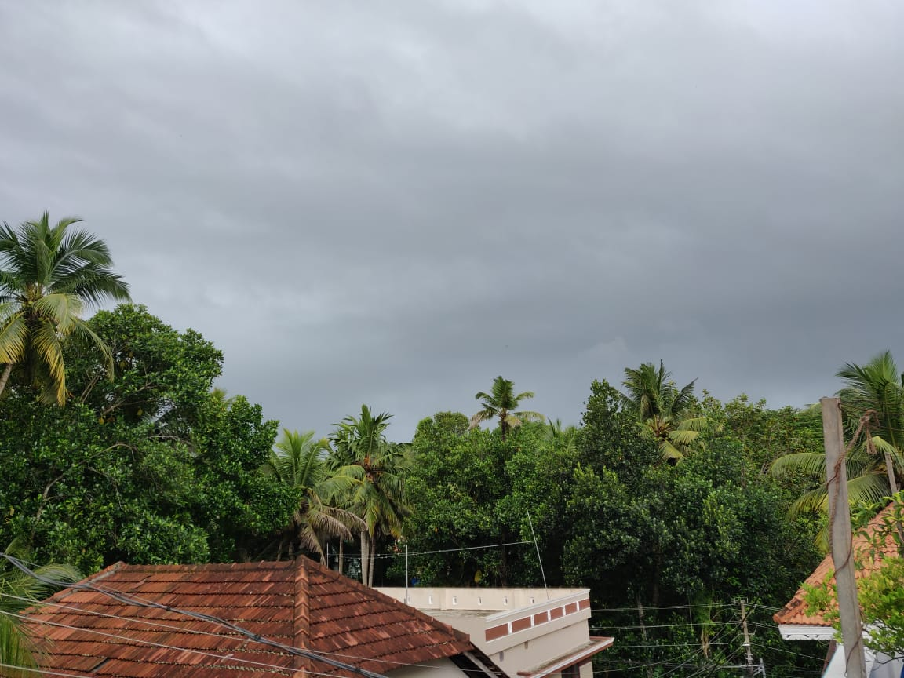

Hi! I am Ben, a software engineer, a husband, a father and a voracious learner (listed in random order).

I have been working as a remote engineer for quite a few years now. A view from my current home office:

Most of my professinonal work has revolved around Golang and Node.js. Occasionally, I have also played around with Kafka, MySQL, Redis, Datadog, Docker, Kubernetes and little pinch of AWS :)

I recently cleared the [CKAD](https://www.cncf.io/certification/ckad/) certification. It proves nothing, but it was fun re-living the _exam pressure_ after a long time!

I love learning human languages as well. A language unknown to my ears is simply fascinating!
